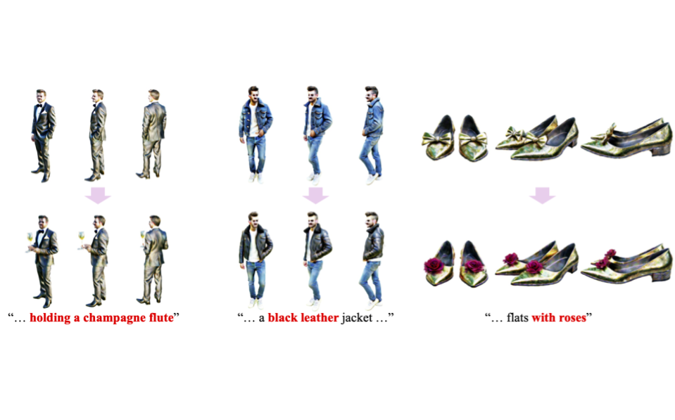

## Curriculum Vitae

##### [Download Resume](/files/Resume.pdf) 

---
### Research Interests

---

My current research interests lie in generative AI, specifically video and image synthesis. I am pursuing my PhD in the Graphics and Imaging Lab (GRAIL) at the University of Washington, advised by Ira Kemelmacher-Shlizerman, Steve Seitz, and Brian Curless.

---
### Highlights
---
*  June, 2025: I return to Google as PhD Student Researcher.
*  April, 2025: *Perturb-and-Revise: Flexible 3D Editing with Generative Trajectories* is accepted to CVPR 2025 in Nashvill, TN.
*  December, 2024: I attended SIGGRAPH Asia in Tokyo, Japan
*  December, 2024: *Perturb-and-Revise: Flexible 3D Editing with Generative Trajectories* is published on arxiv.
*  October, 2024: *Fashion-VDM: Video Diffusion Model for Virtual Try-On* is published on arxiv.
*  July, 2024: *Fashion-VDM: Video Diffusion Model for Virtual Try-On* is accepted to SIGGRAPH Asia 2024 in Tokyo.
*  June, 2024: I return to Google as PhD Student Researcher.
*  Sept, 2023: *DreamPose: Fashion Image-to-Video Synthesis via Stable Diffusion* is published at ICCV 2023 in Paris.
*  June, 2023: I start working as a PhD Student Researcher at Google.
*  April, 2023: *DreamPose: Fashion Image-to-Video Synthesis via Stable Diffusion* is published on arxiv.

---

### Research Projects

---

  
  <h3>Fashion-VDM: Video Diffusion Model for Virtual Try-On, SIGGRAPH Asia 2024</h3>
  
<i><b>Johanna Karras</b>, Yingwei Li, Nan Liu, Luyang Zhu, Innfarn Yoo, Andreas Lugmayr, Chris Lee, Ira Kemelmacher-Shlizerman</i>

  Given a garment image and person video, Fashion-VDM synthesizes a photorealistic try-on video. We introduce a state-of-the-art video virtual try-on model based on diffusion, split classifier-free guidance, joint image-video training for try-on, and a progressive temporal training scheme.

#### [Project Page](https://johannakarras.github.io/Fashion-VDM/) | [Arxiv](https://arxiv.org/abs/2411.00225)

 

  
  <h3>Perturb-and-Revise: Flexible 3D Editing with Generative Trajectories, CVPR 2025</h3>
  
<i>Susung Hong, <b>Johanna Karras</b>, Ricardo Martin-Brualla, Ira Kemelmacher-Shlizerman</i>

  
We propose Perturb-and-Revise, which makes possible a variety of NeRF editing. First, we perturb the NeRF parameters with random initializations to create a versatile initialization. Then, we revise the edited NeRF via generative trajectories.

#### [Project Page](https://susunghong.github.io/Perturb-and-Revise/) | [Arxiv](https://arxiv.org/abs/2412.05279)

 

  
  <h3>DreamPose: Fashion Image-to-Video Synthesis via Stable Diffusion, ICCV 2023</h3>
  
<i><b>Johanna Karras</b>, Aleksander Holynski, Ting-Chun Wang, Ira Kemelmacher-Shlizerman</i>

  
Given a person image and pose sequence, DreamPose generates an animation of the input person following the pose sequence. DreamPose equips Stable Diffusion with pose-and-image guidance, using a novel encoder architecture and finetuning strategy.

#### [Project Page](https://grail.cs.washington.edu/projects/dreampose/) | [Arxiv](https://arxiv.org/abs/2304.06025)

 

#### Deep Neural Networks for Black Hole Imaging

* As an undergraduate at Caltech, I worked in with Professor Katie Bouman and Dr. He Sun on deep neural network techniques for black hole imaging. The project was presented at CVPR 2021. See the project and extended abstract in the [Github Repo](https://github.com/johannakarras/Deep-Neural-Networks-for-Black-Hole-Imaging).

---

### Internships

---
* Google, *PhD Student Researcher* (Summer 2025)

* Google, *PhD Student Researcher* (Summer 2024)
  
* Google, *PhD Student Researcher* (Summer 2023)

* Streetscope Inc., *Computer Vision/AI Intern* (Summer 2021)

* J.P. Morgan, *Software Engineering Intern* (Summer 2019)

* Microsoft, *Explore Intern* (Summer 2018)

---
### Awards & Recognition

---

* UW Reality Lab -- Amazon Fellowship (2022)

* Google Computer Science Mentorship Program (2021)

* NCWIT Collegiate Award Finalist (2020)

* Caltech Summer Undergraduate Research Fellowship (SURF) (2020)

---
