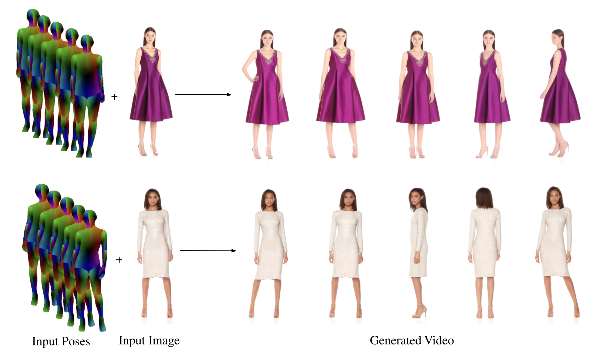

## Curriculum Vitae

##### [Download CV.pdf](/files/CV.pdf) 

---
### Research Interests

---

My research lies at the intersection of machine learning, computer vision, and graphics. I am currently interested in still image reanimation and generative modeling.

---
### Highlights
---
*  October, 2024: *Fashion-VDM: Video Diffusion Model for Virtual Try-On* is published on arxiv.
*  July, 2024: *Fashion-VDM: Video Diffusion Model for Virtual Try-On* is accepted to SIGGRAPH Asia 2024 in Tokyo.
*  June, 2024: I return as a PhD Student Researcher at Google.
*  Sept, 2023: *DreamPose: Fashion Image-to-Video Synthesis via Stable Diffusion* is published at ICCV 2023 in Paris.
*  June, 2023: I start working as a PhD Student Researcher at Google.
*  April, 2023: *DreamPose: Fashion Image-to-Video Synthesis via Stable Diffusion* is published on arxiv.

---

### Research Projects

---
#### [Fashion-VDM: Video Diffusion Model for Virtual Try-On](https://johannakarras.github.io/Fashion-VDM/) (SIGGRAPH Asia 2024)

#### [DreamPose: Fashion Image-to-Video Synthesis via Stable Diffusion](https://grail.cs.washington.edu/projects/dreampose/) (ICCV 2023)

#### Deep Neural Networks for Black Hole Imaging

* As an undergraduate at Caltech, I worked in with Professor Katie Bouman and Dr. He Sun on deep neural network techniques for black hole imaging. The project was presented at CVPR 2021. See the project and extended abstract in the [Github Repo](https://github.com/johannakarras/Deep-Neural-Networks-for-Black-Hole-Imaging).

---

### Internships

---

* Google, *PhD Student Researcher* (Summer 2024)
  
* Google, *PhD Student Researcher* (Summer 2023)

* Streetscope Inc., *Computer Vision/AI Intern* (Summer 2021)

* J.P. Morgan, *Software Engineering Intern* (Summer 2019)

* Microsoft, *Explore Intern* (Summer 2018)

---
### Awards & Recognition

---

* UW Reality Lab -- Amazon Fellowship (2022)

* Google Computer Science Mentorship Program (2021)

* NCWIT Collegiate Award Finalist (2020)

* Caltech Summer Undergraduate Research Fellowship (SURF) (2020)

---
